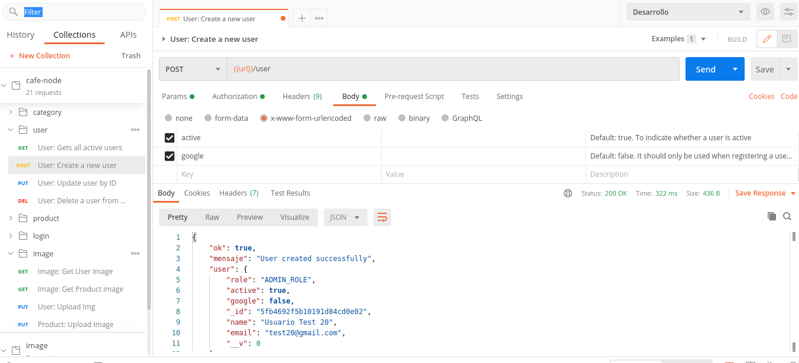
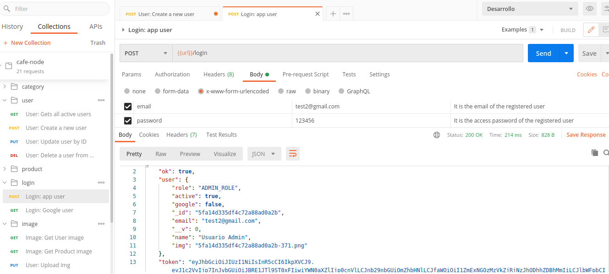

# Cafe Server con NodeJS y MongoDB
---
## ¿Qué es api-rest-cafe-node? 🤔

Hablamos de una Api Restfull para cafetería que cuenta con CRUD de usuarios, productos y categorías. Permite la autenticación con un usuario de base de datos o usando tus credenciales de Google a través de la api de Google. También cuenta con un servicio de imágenes que permite subir y obtener imágenes del servidor.
Si lo desea, el usuario puede cerrar sesión una vez que haya terminado de trabajar con la aplicación.

## Instalación 🔧

Después de clonar el repositorio recuerda instalar los node modules:
```
npm install
```
Inicie el servidor con el comando:
```
node server/server.js
```
Por defecto, el servidor se ejecuta en: [](http://localhost:3000/).
Puedes cambiarlo en el archivo 'server/congif/config.js' 

---
## Tecnologías usadas 🛠️
- HTML
- JavaScript
- NodeJS
- MongoDB
- Express
- Robo3T
- Visual Studio Code
- Git/Git Hub
- Postman
- Heroku
---
## ¿Quieres ver la aplicación en ejecución? 🚀

Pero recuerda que es una aplicación backend. En el frontend solo está implementado para poder autenticarse con la api de Google.
 [Click here!](https://arcane-hamlet-70748.herokuapp.com/)

---
## ¿Quieres ver cómo funciona la aplicación? 📖
Puede consultar la documentación aquí y probarla utilizando Postman.
[Click here!](https://documenter.getpostman.com/view/13054206/TVeqe7eN)

---
## Ejemplos de funcionamiento ⚙️
#### Crear un nuevo usuario


---

#### Inicio de sesión de usuario


---

